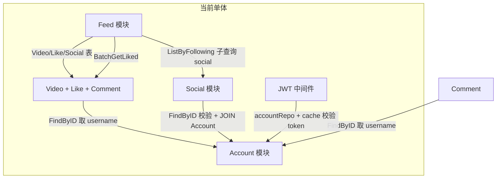
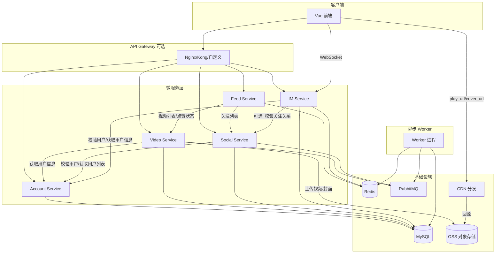

# feedsystem_video_go 微服务拆分开发计划

## 一、现状与拆分边界

### 1.1 当前依赖关系




### 1.2 数据表归属与存储现状

| 表       | 归属服务    | 说明         |
| ------- | ------- | ---------- |
| account | Account | 用户账号       |
| video   | Video   | 视频主体       |
| like    | Video   | 点赞（与视频强耦合） |
| comment | Video   | 评论（与视频强耦合） |
| social  | Social  | 关注关系       |

*（IM 相关表 message、conversation 为新建，归属 IM Service，见 2.2、3.4）*

**存储现状**：视频与封面当前存储在本地 `.run/uploads/`，由 Gin Static 提供访问。拆分后改为 OSS + CDN（见 3.5）。


---

## 二、目标微服务架构

### 2.1 服务划分




### 2.2 各服务职责与 API


| 服务                  | 端口建议 | 核心功能                                             | 依赖                                           |
| ------------------- | ---- | ------------------------------------------------ | -------------------------------------------- |
| **Account Service** | 8081 | 注册、登录、登出、改密、重命名、FindByID/FindByUsername、Token 校验 | MySQL, Redis                                 |
| **Video Service**   | 8082 | 视频 CRUD、上传至 OSS、点赞、评论、Like/Comment 相关 API       | MySQL, Redis, RabbitMQ, Account(gRPC), OSS  |
| **Social Service**  | 8083 | 关注/取关、粉丝列表、关注列表                                  | MySQL, RabbitMQ, Account(gRPC)               |
| **Feed Service**    | 8084 | 最新/点赞数/热度/关注流 四种 Feed                            | Redis, Video(gRPC), Social(gRPC), Like(gRPC) |
| **IM Service**      | 8085 | 单聊、消息历史、会话列表、在线状态、未读数、WebSocket 实时推送 | MySQL, Redis, Account(gRPC), Social(gRPC 可选) |
| **Worker**          | -    | Like/Comment/Social/Popularity 四个消费者             | MySQL, Redis, RabbitMQ                       |
| **API Gateway**     | 8080 | 路由、鉴权、聚合（可选）                                     | 各后端服务                                        |


---

## 三、实现方案

### 3.1 服务间通信

- **同步调用**：gRPC 或 REST
  - Account 暴露 `ValidateToken`、`GetUserByID`、`GetUsersByIDs` 等
  - Video 暴露 `ListVideos`、`GetVideoDetail`、`BatchIsLiked`
  - Social 暴露 `GetFollowingIDs`、`GetFollowerIDs`（IM 可选调用以校验关注关系）
- **异步事件**：沿用现有 RabbitMQ Topic（like.events、comment.events、social.events、video.popularity.events）

### 3.2 鉴权方案

**方案 A（推荐）**：API Gateway 统一鉴权

- Gateway 调用 Account 的 `/internal/validate` 校验 token
- 校验通过后，将 `X-Account-ID`、`X-Username` 注入请求头，转发给下游
- 下游服务信任 Gateway，不再重复校验

**方案 B**：各服务独立鉴权

- 抽取共享 `auth` 库（JWT 解析 + 可选 Account HTTP 校验）
- 每个服务独立解析 JWT，必要时调用 Account 校验 token 是否 revoked

### 3.3 跨服务数据获取


| 场景                            | 当前实现                               | 微服务实现                                                            |
| ----------------------------- | ---------------------------------- | ---------------------------------------------------------------- |
| 发布视频填 username                | Handler 调用 accountService.FindByID | Video 服务 gRPC 调用 Account.GetUserByID                             |
| Social 返回粉丝/关注列表              | Repo JOIN account 表                | Social 查出 ID 列表后，gRPC 调用 Account.GetUsersByIDs                   |
| Feed.buildFeedVideos 填 author | Video 表有 username 冗余               | 保留冗余，通过 Account 事件同步；或 Feed 调用 Account 批量补全                      |
| Feed.ListByFollowing          | FeedRepo 子查询 social 表              | Feed 调用 Social.GetFollowingIDs(userID)，再调用 Video.ListByAuthorIDs |
| Feed 热榜                       | 直接查 Redis ZSET + Video 表           | Feed 查 Redis，拿到 video_ids 后 gRPC 调用 Video.GetByIDs               |


### 3.4 数据库拆分

- **Account**：独立 `account_db`，仅 account 表
- **Video**：独立 `video_db`，含 video、like、comment
- **Social**：独立 `social_db`，仅 social 表
- **IM**：独立 `im_db`，含 message（消息）、conversation（会话）
- **Feed**：无独立库，纯聚合层

Video 表中的 `username`、Comment 表中的 `username` 为冗余字段，通过 Account 服务的「用户改名」事件异步更新，或采用最终一致性。

### 3.5 视频与图片存储（OSS + CDN）

视频、封面等媒体文件采用 OSS 对象存储 + CDN 分发，不再由后端直接托管静态文件。

#### 3.5.1 存储架构

```
用户上传 → Video Service → OSS Bucket
                              ↓
前端播放/展示 ← CDN 边缘节点 ← 回源 OSS
```

- **OSS**：存储原始视频（.mp4）、封面图（.jpg/.png 等），可选用阿里云 OSS、腾讯 COS、AWS S3 或 MinIO（自建）
- **CDN**：play_url、cover_url 返回 CDN 域名，用户请求走 CDN 边缘节点，降低后端压力、减少卡顿

#### 3.5.2 路径与 URL 规则

| 类型 | OSS 路径示例 | 返回 URL 示例 |
|------|--------------|---------------|
| 视频 | `videos/{author_id}/{date}/{random}.mp4` | `https://cdn.example.com/videos/1/20250109/abc123.mp4` |
| 封面 | `covers/{author_id}/{date}/{random}.jpg` | `https://cdn.example.com/covers/1/20250109/def456.jpg` |

- play_url、cover_url 均使用 CDN 域名，便于缓存与加速
- 开发/测试环境可配置为 OSS 直链或本地 mock，生产启用 CDN

#### 3.5.3 Video Service 实现要点

- **上传流程**：接收 multipart 文件 → 校验格式与大小 → 直传 OSS（或先落本地再异步上传），生成 OSS Key
- **URL 生成**：根据 OSS Key 拼接 CDN 域名 + 路径，写入 video 表 play_url、cover_url
- **移除**：不再使用 Gin `r.Static("/static")` 和本地 `.run/uploads` 目录
- **配置**：`OSS_ENDPOINT`、`OSS_BUCKET`、`OSS_ACCESS_KEY`、`CDN_BASE_URL` 等，通过环境变量或 config 注入

#### 3.5.4 降级与兼容

- 未配置 OSS 时，可回退到本地磁盘存储（与现有逻辑兼容），便于本地开发
- CDN 未配置时，play_url 可使用 OSS 公网直链（OSS 支持 Range 请求，可减轻卡顿）

---

## 四、分阶段实施计划

### Phase 1：基础设施与 Account 服务（1–2 周）

1. 创建 `services/` 目录结构，每个服务独立 go.mod
2. 抽取共享包：`pkg/auth`（JWT）、`pkg/config`、`pkg/rabbitmq`、`pkg/redis`
3. 新建 **Account Service**：
  - 从 [backend/internal/account](backend/internal/account) 迁移
  - 独立 MySQL `account_db`
  - 暴露 REST：`/account/register`、`/account/login` 等
  - 新增内部接口：`POST /internal/validate`（校验 token 返回 account_id、username）或 gRPC `ValidateToken`
4. 更新前端：Account 相关请求指向 `http://account:8081`（或通过 Gateway）

### Phase 2：Video 服务（2–3 周）

1. 新建 **Video Service**：
  - 迁移 [backend/internal/video](backend/internal/video)（含 Like、Comment）
  - 独立 MySQL `video_db`（video、like、comment）
  - 依赖 Account：gRPC client 调用 `GetUserByID` 获取 username（发布视频/评论时）
  - 保留 RabbitMQ 发布：like、comment、popularity
  - 暴露 REST：`/video/*`、`/like/*`、`/comment/*`
  - 暴露 gRPC：`GetByIDs`、`BatchIsLiked`、`ListByAuthorIDs` 等供 Feed 调用
2. **视频与图片存储（OSS + CDN）**：
  - 抽取 `pkg/oss` 或 `internal/storage`，封装 OSS 上传（兼容阿里云 OSS / 腾讯 COS / S3 / MinIO）
  - 上传接口：接收 multipart 文件，直传 OSS，返回 CDN URL 写入 play_url、cover_url
  - 配置 OSS（endpoint、bucket、accessKey）、CDN 域名（CDN_BASE_URL）
  - 移除本地 `r.Static("/static")` 及 `.run/uploads` 依赖
  - 支持未配置 OSS 时降级到本地磁盘，便于本地开发

### Phase 3：Social 服务（1 周）

1. 新建 **Social Service**：
  - 迁移 [backend/internal/social](backend/internal/social)
  - 独立 MySQL `social_db`（social 表）
  - 依赖 Account：gRPC `GetUsersByIDs` 补全粉丝/关注列表的用户信息
  - 暴露 REST：`/social/follow`、`/social/unfollow` 等
  - 暴露 gRPC：`GetFollowingIDs(followerID)` 供 Feed 调用

### Phase 4：Feed 服务（2 周）

1. 新建 **Feed Service**：
  - 迁移 [backend/internal/feed](backend/internal/feed)
  - 无独立 DB，仅依赖 Redis（缓存、热榜）+ 其他服务 gRPC
  - 实现流程：
    - `ListLatest`：gRPC Video.ListLatest，再 gRPC Like.BatchIsLiked
    - `ListByFollowing`：gRPC Social.GetFollowingIDs → gRPC Video.ListByAuthorIDs → BatchIsLiked
    - `ListByPopularity`：Redis ZSET + gRPC Video.GetByIDs + BatchIsLiked
  - 共享 Redis key 命名空间，与 PopularityWorker 约定一致

### Phase 5：Worker 与 Gateway（1–2 周）

1. **Worker**：
  - 保持单一进程，消费 4 个队列
  - 连接多个 MySQL：account_db（可选）、video_db、social_db
  - 连接 Redis（PopularityWorker）
2. **API Gateway**（可选）：
  - 使用 Nginx 或 Go 自研
  - 路由：`/api/account` → Account、`/api/video` → Video、`/api/im` → IM 等；IM 的 WebSocket 可单独路由或直连 IM 服务
  - 鉴权：Gateway 调用 Account 校验 token，注入 `X-Account-ID`
3. **Docker Compose**：
  - 新增 account、video、social、feed 四个服务（Phase 6 新增 im）
  - 统一 MySQL 可先分库不分实例，后期再拆实例
  - Video 服务需注入 OSS 配置（OSS_ENDPOINT、OSS_BUCKET、OSS_ACCESS_KEY、OSS_SECRET_KEY、CDN_BASE_URL）；本地开发可省略以走本地存储降级

### Phase 6：IM 服务（2–3 周）

1. 新建 **IM Service**：
   - 独立 MySQL `im_db`：message（消息表）、conversation（会话表）
   - 依赖 Account：gRPC 调用 `ValidateToken`、`GetUserByID`、`GetUsersByIDs` 进行鉴权、补全用户信息
   - 依赖 Social（可选）：如需「仅关注可私聊」则 gRPC 调用 `GetFollowingIDs` 校验
   - 使用 Redis：在线状态（用户-连接映射）、未读数缓存、Pub/Sub 做多实例消息广播
   - WebSocket 长连接：建立连接时校验 Token，维护 user_id ↔ conn 映射
   - REST API：`/im/conversations`（会话列表）、`/im/messages`（消息历史）、`/im/ack`（已读回执）
2. **实时消息**：
   - 客户端通过 WebSocket 接收实时消息
   - 多实例部署时，通过 Redis Pub/Sub 将消息广播到对应用户所在实例
3. **Docker Compose**：新增 im 服务，注入 MySQL、Redis、Account/Social gRPC 地址

---

## 五、目录结构建议

```
feedsystem_video_go-main/
├── pkg/                    # 共享库
│   ├── auth/               # JWT 生成与解析
│   ├── config/             # 配置加载
│   ├── grpc/               # gRPC 客户端工厂
│   ├── oss/                # OSS 上传封装（兼容 S3/阿里云/腾讯云/MinIO）
│   ├── redis/
│   └── rabbitmq/
├── services/
│   ├── account/
│   │   ├── cmd/main.go
│   │   ├── internal/
│   │   └── go.mod
│   ├── video/
│   │   ├── cmd/main.go
│   │   ├── internal/
│   │   ├── proto/          # gRPC 定义
│   │   └── go.mod
│   ├── social/
│   ├── feed/
│   ├── im/
│   │   ├── cmd/main.go
│   │   ├── internal/
│   │   └── go.mod
│   └── worker/
├── gateway/                # 可选
├── frontend/
├── docker-compose.yml
└── README.md
```

---

## 六、风险与注意事项

1. **分布式事务**：关注/点赞等若需强一致，可考虑 Saga 或最终一致性（当前已用 MQ 异步，可沿用）
2. **网络延迟**：Feed 聚合多服务调用，需设置合理超时、熔断（如 go-kit、hystrix）
3. **数据冗余**：Video.username 等需通过事件同步，避免各服务直接连 Account 库
4. **JWT Secret**：所有服务需共享同一 JWT_SECRET，确保 Token 可跨服务解析
5. **OSS 依赖**：未配置 OSS 时降级本地存储；CDN 需在 OSS 控制台绑定回源，并配置 CORS 允许前端跨域播放
6. **IM 扩展**：WebSocket 多实例需 Redis Pub/Sub 做消息路由；高并发时考虑消息分表、冷热分离

---

## 七、实施顺序总结


| 阶段  | 服务               | 工作量   | 依赖            |
| --- | ---------------- | ----- | ------------- |
| 1   | 共享 pkg + Account | 1–2 周 | 无             |
| 2   | Video            | 2–3 周 | Account       |
| 3   | Social           | 1 周   | Account       |
| 4   | Feed             | 2 周   | Video, Social |
| 5   | Worker + Gateway | 1–2 周 | 全部          |
| 6   | IM               | 2–3 周 | Account, Social（可选） |


建议先完成 Phase 1，使 Account 独立运行并可供其他服务调用，再按序推进。IM 服务可在 Phase 3（Social）完成后启动。